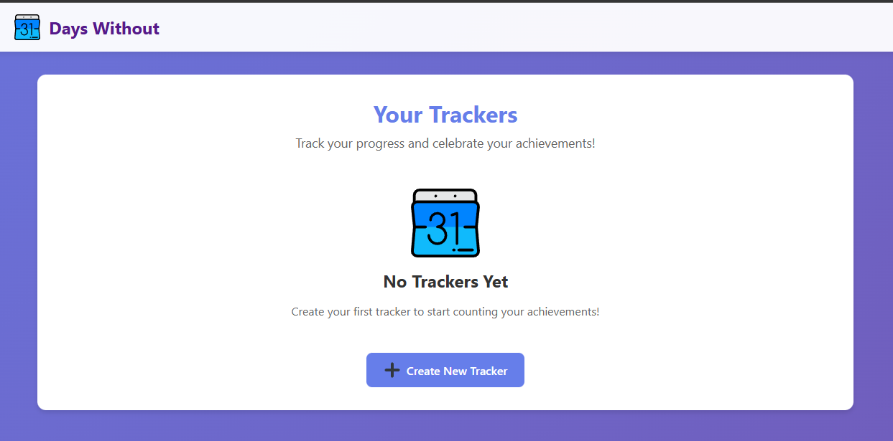
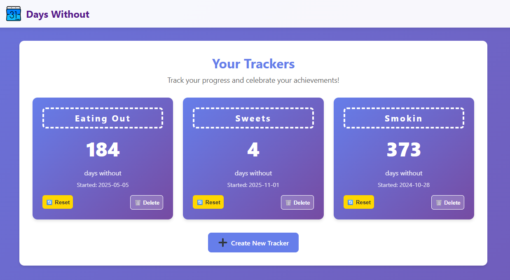

<div align="center">
  
  
  # Days Without
  
  **Track your progress, celebrate your achievements**
  
  [](https://www.docker.com/)
  [](https://flask.palletsprojects.com/)
  [](https://www.python.org/)
  
</div>

---

## 📖 What is Days Without?

**Days Without** is a simple yet powerful habit tracking web application that helps you monitor your progress in breaking habits, maintaining streaks, or celebrating milestones. Whether you're counting days without smoking, days without procrastinating, or days since starting a new healthy routine, Days Without makes it easy to visualize and maintain your progress.

### ✨ Features

- **🎯 Multiple Trackers** - Create unlimited trackers for different habits or goals
- **🔄 Easy Reset** - Reset your counter when needed with a single click
- **🗑️ Tracker Management** - Delete trackers you no longer need
- **📅 Custom Start Dates** - Backdate your tracker to any past date
- **🔐 Optional Authentication** - Toggle user login system on/off based on your needs
- **📱 Responsive Design** - Works seamlessly on desktop, tablet, and mobile devices
- **🎨 Modern UI** - Clean, intuitive interface with smooth animations
- **💾 Persistent Storage** - SQLite database ensures your data is never lost
- **🔄 Database Migrations** - Built-in migration system keeps your database up-to-date

## 📸 Screenshots

<div align="center">
  <br>
  
</div>

## 🚀 Quick Start with Docker

### Using Docker Compose (Recommended)

The easiest way to run Days Without is using Docker Compose:

1. **Create a `docker-compose.yml` file:**

```yaml
services:
  web:
    image: ghcr.io/simon-b64/days-without:latest
    ports:
      - "8000:8000"
    volumes:
      - days-without-data:/app/instance
    restart: unless-stopped

volumes:
  days-without-data:
    driver: local
```

2. **Start the application:**

```bash
docker-compose up -d
```

3. **Access the app:**

Open your browser and navigate to `http://localhost:8000`

### Using Docker CLI

Alternatively, you can run the container directly:

```bash
# Pull the latest image
docker pull ghcr.io/simon-b64/days-without:latest

# Run the container
docker run -d \
  --name days-without \
  -p 8000:8000 \
  -v days-without-data:/app/instance \
  --restart unless-stopped \
  ghcr.io/simon-b64/days-without:latest
```

### Building from Source

If you want to build the Docker image yourself:

```bash
# Clone the repository
git clone https://github.com/YOUR_USERNAME/DaysWithout.git
cd DaysWithout

# Build the image
docker build -t days-without:local .

# Run the container
docker run -d \
  --name days-without \
  -p 8000:8000 \
  -v days-without-data:/app/instance \
  --restart unless-stopped \
  days-without:local
```

## 🛠️ Local Development

### Prerequisites

- Python 3.11 or higher
- pip (Python package manager)

### Installation

1. **Clone the repository:**

```bash
git clone https://github.com/YOUR_USERNAME/DaysWithout.git
cd DaysWithout
```

2. **Create a virtual environment:**

```bash
python -m venv venv
source venv/bin/activate  # On Windows: venv\Scripts\activate
```

3. **Install dependencies:**

```bash
pip install -r requirements.txt
```

4. **Initialize the database:**

```bash
flask --app app init-db
```

> **Note:** You can run `init-db` again at any time to update the database schema and apply migrations. The command is idempotent and will preserve your existing data while updating the structure.

5. **Run the development server:**

```bash
flask --app app run --debug
```

6. **Access the app:**

Open your browser and navigate to `http://localhost:5000`

## 🤝 Contributing

Contributions are welcome! Here's how you can help:

### Getting Started

1. **Fork the repository** on GitHub
2. **Clone your fork** locally:
   ```bash
   git clone https://github.com/YOUR_USERNAME/DaysWithout.git
   ```
3. **Create a new branch** for your feature:
   ```bash
   git checkout -b feature/amazing-feature
   ```
4. **Make your changes** and commit them:
   ```bash
   git commit -m "Add some amazing feature"
   ```
5. **Push to your fork**:
   ```bash
   git push origin feature/amazing-feature
   ```
6. **Open a Pull Request** on GitHub

### Development Guidelines

- Follow PEP 8 style guidelines for Python code
- Write clear, descriptive commit messages
- Test your changes thoroughly before submitting
- Update documentation if you're adding new features
- Keep pull requests focused on a single feature or fix

## 🏗️ Tech Stack

### Backend
- **[Flask](https://flask.palletsprojects.com/)** - Lightweight Python web framework
- **[SQLite](https://www.sqlite.org/)** - Embedded relational database
- **Python 3.11+** - Core programming language

### Frontend
- **HTML5** - Semantic markup
- **CSS3** - Modern styling with gradients and animations
- **[Jinja2](https://jinja.palletsprojects.com/)** - Template engine for dynamic content

### DevOps
- **[Docker](https://www.docker.com/)** - Containerization platform
- **[GitHub Actions](https://github.com/features/actions)** - CI/CD pipeline
- **[GitHub Container Registry](https://ghcr.io)** - Docker image hosting

### Dependencies
For a complete list of Python dependencies, see the `requirements.txt` file in the project root. Install all required packages with:

```bash
pip install -r requirements.txt
```

## 📝 Configuration

Days Without uses sensible defaults and requires minimal configuration. The database is automatically created in the `instance/` directory on first run.

### Authentication Mode

By default, Days Without runs in **anonymous mode** (no login required). You can toggle authentication on/off using the `ANONYMOUS` configuration setting.

#### Anonymous Mode (Default)
When `ANONYMOUS=True`, the app runs without authentication:
- No login/registration required
- All trackers are accessible to everyone
- Perfect for personal/single-user deployments

#### Multi-User Mode
When `ANONYMOUS=False`, the app requires user authentication:
- Users must register and login
- Each user has their own private trackers
- Secure authentication with password hashing
- Ideal for shared/family deployments

### Configuration File

Create an `instance/config.py` file to customize settings:

```python
# Toggle authentication (True = no login required, False = login required)
ANONYMOUS = False  # Set to True for anonymous mode

# Secret key for session management (change this in production!)
SECRET_KEY = 'your-secret-key-here'

# Custom database path (optional)
DATABASE = '/path/to/custom/database.db'
```

### Database Migrations

The app includes a built-in migration system. To update your database schema:

**For local development:**

```bash
flask --app app init-db
```

**For Docker deployments:**

```bash
# If using Docker Compose
docker-compose exec web flask --app app init-db

# If using Docker CLI
docker exec -it days-without flask --app app init-db
```

This command will:
- Create the database if it doesn't exist
- Apply all pending migrations automatically
- Preserve your existing data
- Update the database schema to the latest version

You can safely run this command multiple times - it's idempotent and won't duplicate data or break your existing trackers.

## 📜 License

This project is open source and available under the [MIT License](LICENSE).

## 🙏 Acknowledgments

- Icon from [SVG Repo](https://www.svgrepo.com/)
- Inspired by the need for simple, effective habit tracking

---

<div align="center">
  Made with ❤️ by Simon B.
  
  ⭐ Star this repo if you find it useful!
</div>

